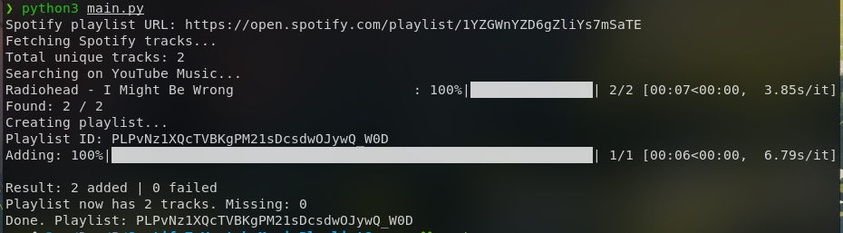

# Spotify to YouTube Music Playlist Transfer

Transfer Spotify playlists to YouTube Music using Python.



---

# Requirements

* Python 3.10+
* Spotify account
* YouTube Music account

Install dependencies:

```bash
pip install -r requirements.txt
```

---

# Spotify Setup

Create a Spotify application:

https://developer.spotify.com/dashboard

After creating the app, get:

* Client ID
* Client Secret

Create a `.env` file in the project root:

```env
SPOTIFY_CLIENT_ID=your_client_id
SPOTIFY_CLIENT_SECRET=your_client_secret
```

---

# YouTube Music Setup

Run:

```bash
ytmusicapi browser
```

The command will ask for request headers from your browser.

## How to get headers

1. Open YouTube Music in your browser
2. Press `F12`
3. Open the `Network` tab
4. Refresh the page
5. Click any request to `music.youtube.com`
6. Copy the request headers
7. Paste them into the terminal running `ytmusicapi browser`

This generates:

```text
browser.json
```

Place `browser.json` in the project root.

---

# Project Structure

Expected structure:

```text
project/
├── main.py
├── browser.json
├── .env
├── requirements.txt
└── README.md
```

---

# Usage

Run:

```bash
python3 main.py
```

Paste a Spotify playlist URL when prompted.

Example:

```text
https://open.spotify.com/playlist/xxxxxxxxxxxx
```

The script will:

1. Read the Spotify playlist
2. Search tracks on YouTube Music
3. Create a new playlist
4. Add all matched tracks automatically

---

# Features

* Playlist name preservation
* Automatic retries
* Request timeout handling
* Search result caching
* Duplicate prevention
* Chunked playlist insertion
* Missing track recovery attempts
* Progress bars

---

# Generated Files

## cache.json

Stores previous search results to speed up future imports.

Delete this file to force fresh searches.

## missing_video_ids.json

Created only if some tracks fail to be added.

Contains missing YouTube video IDs for debugging or manual recovery.

## browser.json

Authentication file generated by `ytmusicapi browser`.

Do not share this file.

---

# Notes

* Some songs may not exist on YouTube Music
* Large playlists may take several minutes
* The script uses delays to reduce rate limiting
* Songs are added in chunks to reduce API failures
* Duplicate tracks are automatically removed
* The created playlist keeps the original Spotify playlist name

---

# Troubleshooting

## Invalid Spotify URL

Make sure the playlist URL looks like:

```text
https://open.spotify.com/playlist/<id>
```

## Playlist is private or inaccessible

Make the Spotify playlist public.

## JSONDecodeError

Usually caused by temporary rate limits.

Wait a few minutes and try again.

## oauth_credentials error

Delete `browser.json` and regenerate it:

```bash
ytmusicapi browser
```
